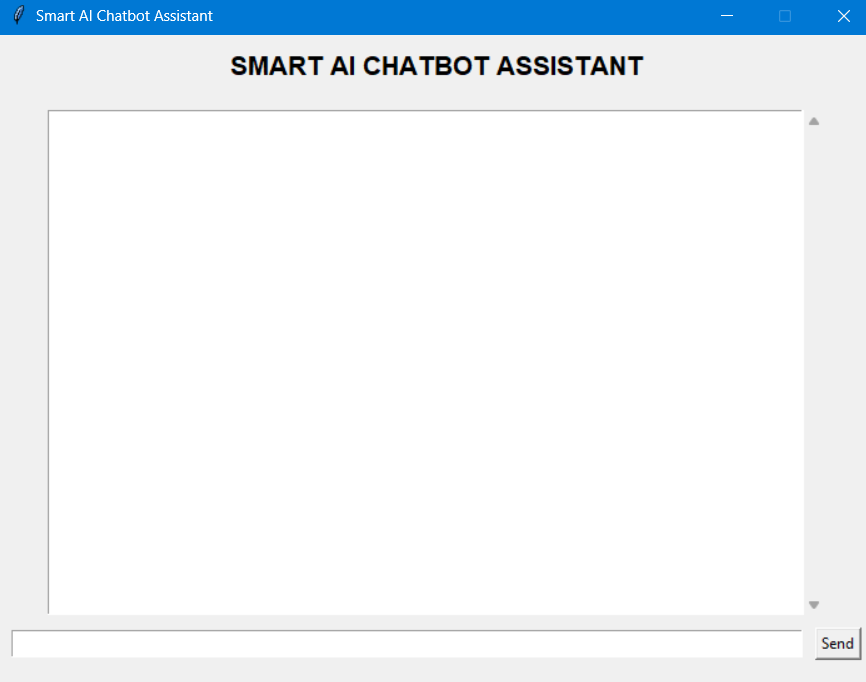
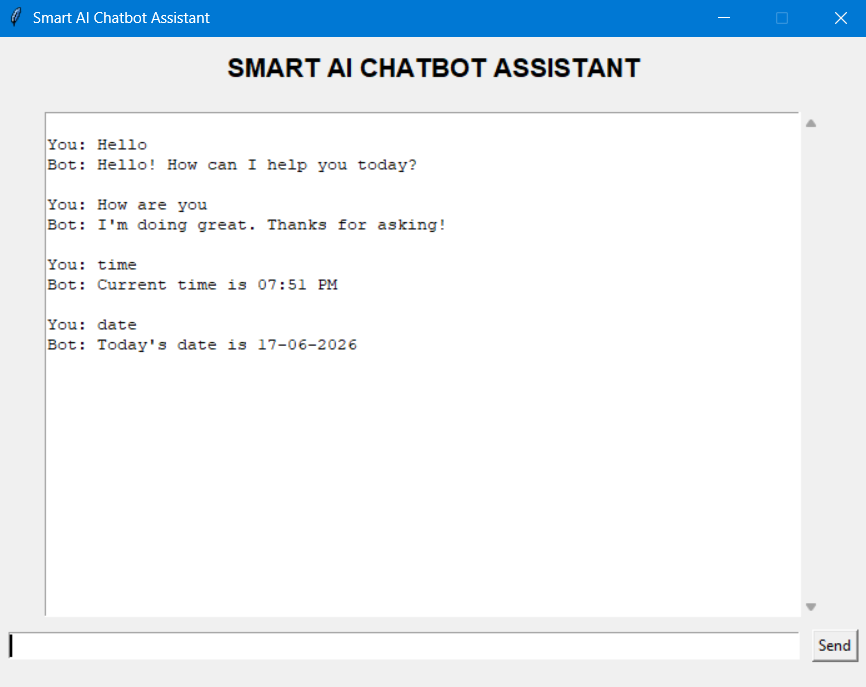
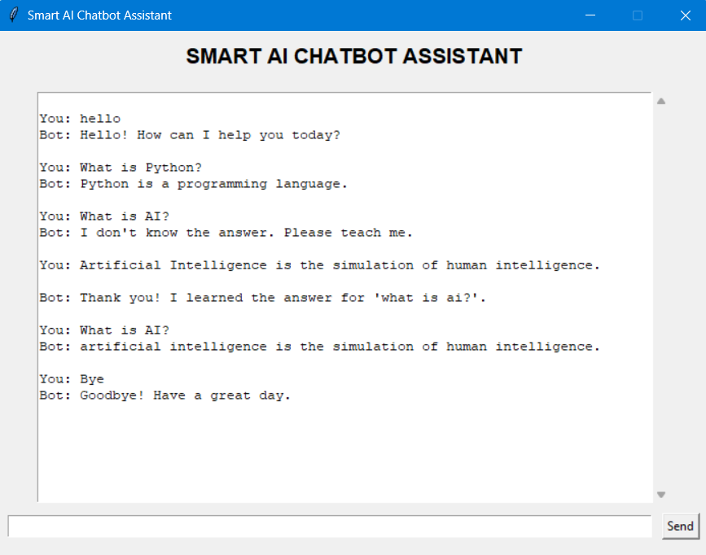
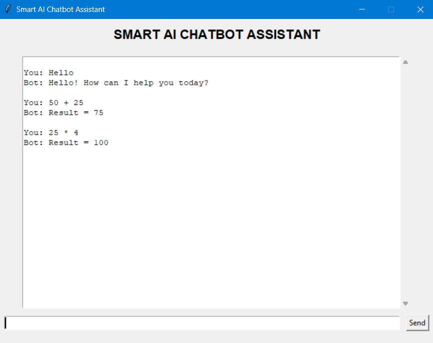
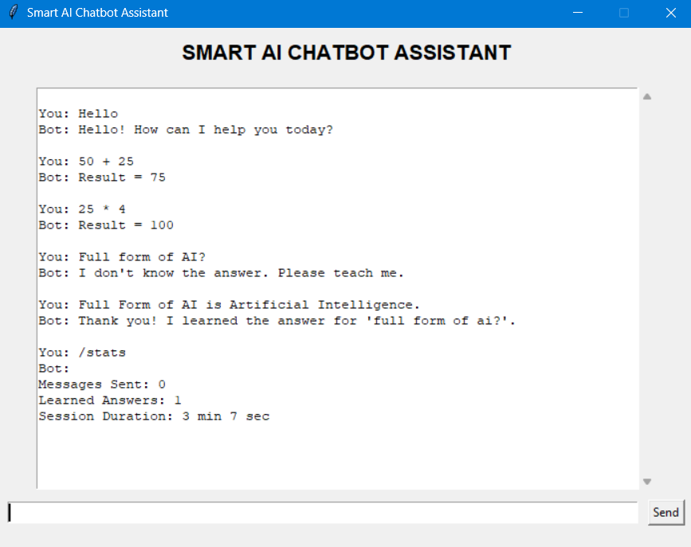

# 🤖 Smart AI Chatbot Assistant

A Python-based intelligent chatbot that can interact with users through a graphical user interface (GUI), learn new responses, store knowledge permanently, perform calculations, maintain chat history, and display session statistics.

This project was developed to demonstrate practical Python concepts such as GUI development, file handling, JSON data storage, regular expressions, modular programming, and state management.

---

# 📌 Features

## 💬 Interactive Chat System

* Communicates with users through a graphical interface.
* Responds to predefined commands and greetings.
* Maintains a conversational workflow.

### Supported Commands

| Command          | Description                 |
| ---------------- | --------------------------- |
| hello / hi / hey | Greeting response           |
| how are you      | Status response             |
| time             | Shows current time          |
| date             | Shows current date          |
| /stats           | Displays chatbot statistics |
| bye              | Ends conversation           |

---

## 🧠 Self-Learning Capability

If the chatbot encounters an unknown question:

1. It asks the user to teach it.
2. The answer is stored permanently.
3. The chatbot remembers the answer for future sessions.

### Example

User: What is Python?

Bot: I don't know the answer. Please teach me.

User: Python is a programming language.

Bot: Thank you! I learned the answer.

Next time:

User: What is Python?

Bot: Python is a programming language.

---

## 🧮 Calculator Module

The chatbot can evaluate arithmetic expressions.

### Examples

User: 10 + 20

Bot: Result = 30

User: 25 * 4

Bot: Result = 100

User: 100 / 4

Bot: Result = 25.0

Supported operators:

* Addition (+)
* Subtraction (-)
* Multiplication (*)
* Division (/)
* Parentheses ()

---

## 📊 Session Statistics

Tracks:

* Total messages sent
* Learned answers
* Session duration

Command:

/stats

Example Output:

Messages Sent: 15

Learned Answers: 3

Session Duration: 5 min 22 sec

---

## 📝 Chat History Logging

All conversations are automatically stored in:

chat_history.txt

Example:

User: hello

Bot: Hello! How can I help you today?

---

User: time

Bot: Current time is 07:45 PM

---

---

## 🗃 Knowledge Base Storage

The chatbot stores learned responses in:

knowledge.json

Example:

{
"what is python": "Python is a programming language.",
"what is ai": "Artificial Intelligence is the simulation of human intelligence by machines."
}

This allows the chatbot to retain knowledge even after the application is closed.

---

# 🏗 Project Architecture

The project follows a modular structure.

Smart-AI-Chatbot/

├── chatbot.py

├── gui.py

├── knowledge.json

├── chat_history.txt

├── README.md

├── requirements.txt

├── .gitignore

└── screenshots/

---

## chatbot.py

Handles:

* Chatbot logic
* Learning system
* Calculator functionality
* Statistics tracking
* Knowledge management

---

## gui.py

Handles:

* Graphical User Interface
* User input
* Chat display
* Event handling

---

## knowledge.json

Stores learned responses permanently.

---

## chat_history.txt

Stores complete conversation history.

---

# 🛠 Technologies Used

* Python
* Tkinter
* JSON
* Regular Expressions (Regex)
* File Handling
* Datetime Module
* Time Module

---

# 🚀 How to Run

## Step 1

Clone the repository:

git clone https://github.com/Niharikasharma05/Smart-AI-Chatbot.git

## Step 2

Navigate to project directory:

cd Smart-AI-Chatbot

## Step 3

Run:

python gui.py

---

# 📸 Screenshots

## Home Screen

Displays the chatbot interface after launching the application.

---

## Chat Interaction

Demonstrates normal user-chatbot interaction.

---

## Learning Feature

Shows how the chatbot learns new responses from the user.

---

## Calculator Module

Demonstrates arithmetic expression evaluation.

---

## Statistics System

Displays session statistics generated by the chatbot.

---

# 🎯 Learning Outcomes

This project helped strengthen understanding of:

* Python Programming
* Functions
* Dictionaries
* File Handling
* JSON Serialization
* GUI Development
* Regular Expressions
* Exception Handling
* State Management
* Modular Programming

---

# 💡 Challenges Faced

### 1. Persistent Memory

Designing a system that remembers learned answers across sessions.

### 2. GUI Integration

Adapting chatbot functionality from a terminal-based system to a Tkinter graphical interface.

### 3. Learning Workflow

Creating a user-friendly method for teaching new responses.

### 4. Code Organization

Separating chatbot logic from user interface code using modular design.

---

# 🔮 Future Enhancements

Potential improvements include:

* Dark Theme Interface
* Voice Input
* Speech Output
* Natural Language Processing (NLP)
* SQLite Database Integration
* Web Deployment
* AI-powered Response Generation

---

# 📈 Project Highlights

✔ Interactive GUI

✔ Self-Learning Chatbot

✔ JSON-Based Knowledge Storage

✔ Calculator Support

✔ Chat History Tracking

✔ Session Analytics

✔ Modular Architecture

✔ Beginner-Friendly Yet Portfolio-Ready

---

# 👨‍💻 Author - Niharika Sharma

Developed as a Python portfolio project to demonstrate practical programming, GUI development, file handling, and chatbot implementation concepts.
